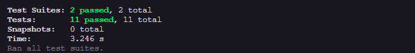

# TDD - FULL STACK




## Índice

- [Visão geral](#visão-geral)
- [O projeto](#o-projeto)
- [Ajustes e melhorias](#Ajustes-e-melhorias)
- [Como rodar](#como-rodar)
- [Premissas assumidas](#premissas-assumidas)
- [Author](#author)

## Visão geral

### O projeto

Esse projeto foi feito para fins de estudo, com o intuito de aplicar o TDD (Test Driven Development) que é uma prática de desenvolvimento onde a codificação das funcionalidades começa a partir de testes unitários.


### Ajustes e melhorias

O projeto ainda está em desenvolvimento e as próximas atualizações serão voltadas nas seguintes tarefas:

- [] Criar testes no frontend, usando a API criada no backend.
- [] Criar UI básico para a funcionalidade.
- [] Completar a API com um CRUD completo.

## Como rodar

Clone o repositório e instale as dependências:

Back-end 🖥️

```bash
cd TDD/backend
npm install
cp .env.example .env # ajuste os valores de acordo com o seu ambiente
npm run start
```

### Premissas Assumidas

- Os usuários terão uma conexão de internet estável.
- O sistema assume que o banco de dados usado seja o mongodb e um banco seja criado com o mesmo nome definido na variável de ambiente, no arquivo .env.


## Author

- linkedin - [Andressa Viana](https://www.linkedin.com/in/andressavbatista/)
- github - [Andressa Viana](https://github.com/andressavianab)